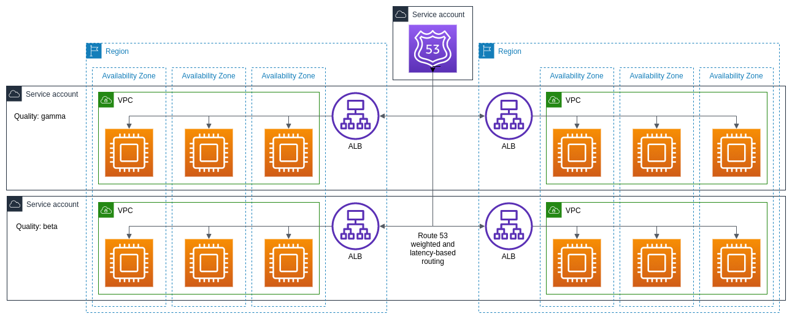

# Diagram of a multi-quality, multi-region service

<figure><figcaption>
A multi-quality, multi-region service
</figcaption></figure>

This diagram depects a service using all the reliability primitives Substrate exposes. The production environment has two qualities. It's running in multiple regions thanks to the Substrate-managed network. Each quality in each region runs the same Terraform code, giving us four incremental steps to use when making changes. A third account hosts a DNS record that uses both geographic and weighted routing to send a small fraction of traffic to the beta infrastructure in whichever region's closest to that particular user and the remaining traffic, using the same geographic routing rule, to the gamma infrastructure.

We can change the code running on this service's EC2 instances one server at a time just by having multiple EC2 instances. Thanks to Substrate, we can do a whole lot more: We can change the autoscaling group and launch template, the security groups, the VPCs, subnets and routing tables, and the load balancer one quality and region at a time. And we can change the service's IAM role one quality at a time.

This architecture could exist within the [diagram of a Substrate-managed AWS organization](diagram-substrate-managed-aws-organization.html).
