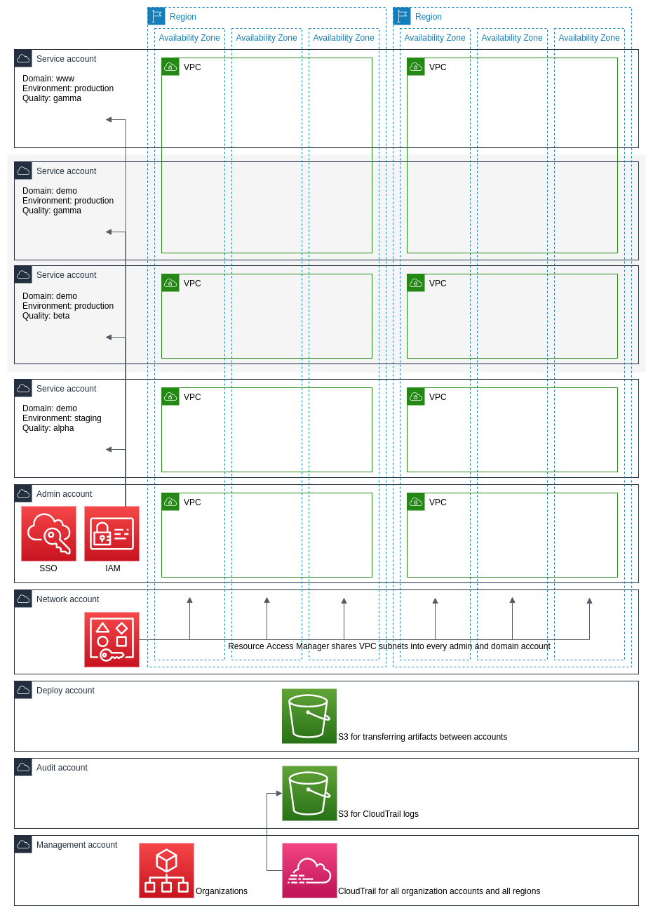

# Diagram of a Substrate-managed AWS organization

<figure><figcaption>
A Substrate-managed AWS organization
</figcaption></figure>

A Substrate-managed AWS organization is comprised of half-a-dozen or more AWS accounts all working together. Briefly, since these [accounts](accounts.html) are all discussed in detail elsewhere:

* Management account: Creates the AWS organization and organization-wide CloudTrail. Receives your bill.
* Audit account: Stores the organization-wide CloudTrail.
* Deploy account: Facilitates moving objects between accounts via S3. Useful as part of CI/CD processes.
* Network account: Creates VPCs and shares them into all the right service accounts.
* Admin account: Integrates with an identity provider, serves the Intranet, and helps authorized humans get into AWS.
* Service accounts: Contain all the rest of the AWS resources, serve your production traffic, and protect customers' data.

Go deeper and take a look at a [diagram of a multi-quality, multi-region service](diagram-multi-quality-multi-region-service.html) provisioned within two service accounts, as highlighted in grey at the top of this diagram.
